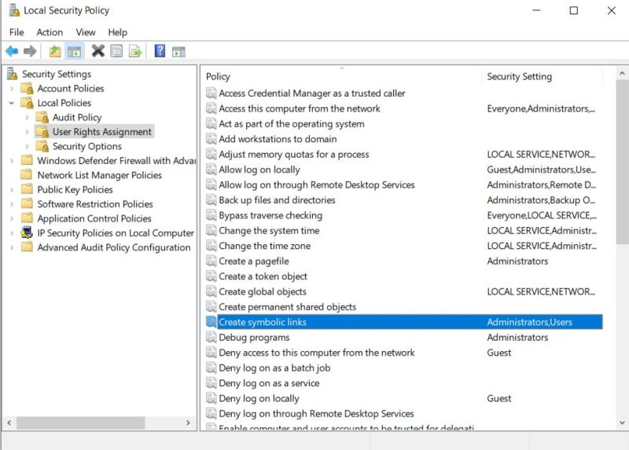
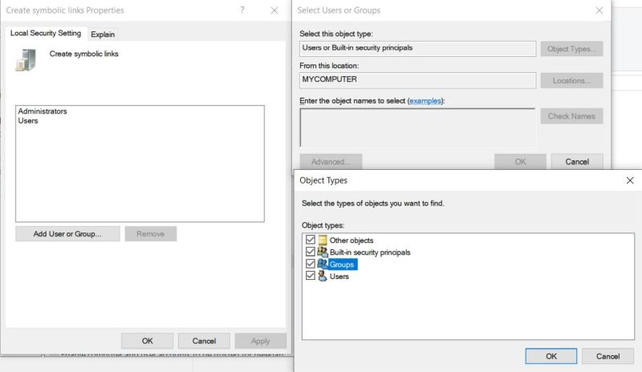

# Latest official docs
- [English](https://docs.unity3d.com/Packages/com.unity.toonshader@latest)
- [日本語](https://docs.unity3d.com/ja/Packages/com.unity.toonshader@latest)

# Unity Toon Shader
---
* [Unity Toon Shader](com.unity.toonshader/Documentation~/index.md)
* [Requirements](com.unity.toonshader/Documentation~/System-Requirements.md)
* [Installation](com.unity.toonshader/Documentation~/installation.md)
* [What's new](com.unity.toonshader/Documentation~/whats-new.md)
  * [0.10.x-preview](com.unity.toonshader/Documentation~/whats-new-0.10.x.md)
  * [0.9.x-preview](com.unity.toonshader/Documentation~/whats-new-0.9.x.md)
  * [0.8.x-preview](com.unity.toonshader/Documentation~/whats-new-0.8.x.md)
  * [0.7.x-preview](com.unity.toonshader/Documentation~/whats-new-0.7.x.md)
  * [0.6.x-preview](com.unity.toonshader/Documentation~/whats-new-0.6.x.md)
  * [0.5.x-preview](com.unity.toonshader/Documentation~/whats-new-0.5.x.md)
  * [0.4.x-preview](com.unity.toonshader/Documentation~/whats-new-0.4.x.md)
  * [0.3.x-preview](com.unity.toonshader/Documentation~/whats-new-0.3.x.md)
* [Getting Started](com.unity.toonshader/Documentation~/GettingStarted.md)
* [Material Converter](com.unity.toonshader/Documentation~/MaterialConverter.md)
* [Shader Parameter Settings](com.unity.toonshader/Documentation~/Parameter-Settings.md)
  * [Modes](com.unity.toonshader/Documentation~/Modes.md)
  * [Shader Settings](com.unity.toonshader/Documentation~/Shader.md)
  * [Three Color Map and Control Map Settings](com.unity.toonshader/Documentation~/Basic.md)
  * [Shading Step and Feather Settings](com.unity.toonshader/Documentation~/ShadingStepAndFeather.md)
  * [Normal Map Settings](com.unity.toonshader/Documentation~/NormalMap.md)
  * [Highlight Settings](com.unity.toonshader/Documentation~/Highlight.md)
  * [Rim Light Settings](com.unity.toonshader/Documentation~/Rimlight.md)
  * [Material Capture (MatCap) Setting](com.unity.toonshader/Documentation~/MatCap.md)
  * [Emission Settings](com.unity.toonshader/Documentation~/Emission.md)
  * [Angel Ring Projection Settings](com.unity.toonshader/Documentation~/AngelRing.md)
  * [Scene Light Effectiveness Settings](com.unity.toonshader/Documentation~/SceneLight.md)
  * [Metaverse Settings(Experimental)](com.unity.toonshader/Documentation~/Metaverse.md)
  * [Outline Settings](com.unity.toonshader/Documentation~/Outline.md)
  * [Tessellation Settings(the Built-in Render Pipeline)](com.unity.toonshader/Documentation~/TessellationLegacy.md)
  * [Tessellation Settings(HDRP)](com.unity.toonshader/Documentation~/TessellationHDRP.md)
* [Toon EV Adjustment(HDRP)](com.unity.toonshader/Documentation~/ToonEVAdjustment.md)  
* [Samples](com.unity.toonshader/Documentation~/sample-instlation.md)
* [Feature Difference](com.unity.toonshader/Documentation~/FeatureModel_en.md)
* [Known Issues](com.unity.toonshader/Documentation~/Known-issue.md)


# Post-Cloning Setup on Windows

This repository utilizes symbolic links to share code across multiple projects. 
On Windows 10 or later, symbolic link creation is restricted by default for regular users, 
which can lead to issues when working with this repository. 

To resolve this, follow the steps below to enable symbolic link creation and configure Git appropriately.

1. Open **Local Security Policy** by typing `secpol.msc` on Windows Command Prompt




2. Under **User Rights Assignment**, find a policy called **Create symbolic links** and open it.
  - Click **Add User or Group**
  - Click **Object Types**
  - Make sure **Groups** is checked and click **OK**.



3. Type **USERS** inside the textbox and click on **Check Names** to verify it, then click **OK**.


4. Configure git to allow symbolic links. For example, by typing the following in Git Bash:

```
git config --local core.symlinks true
git config --global core.symlinks true
```

